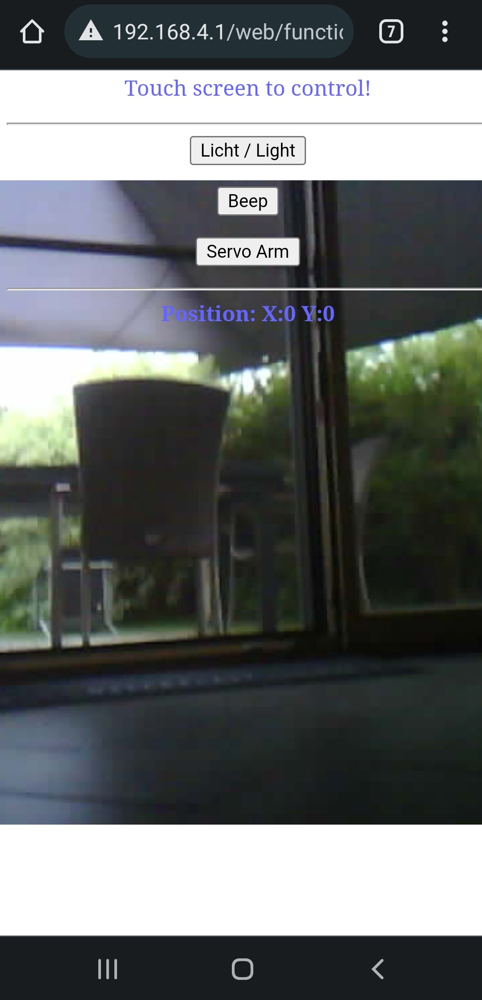

# ESP32 Camera Kidbuild Balance-Robot

## Description
This is the ESP32-CAM who works seamless with the kidbuild balance robot.You will see the live picture as a stream as background
 of the Balance-Robot.

## Features
- The source is merged to the platformio enviroment.
- The project is open source. You can change the code.
- Use the project for education!

## Electronic schematic
Standard ESP32-CAM

## How does it work?
During boot up of robot, the wifi will be scanned. The robot will find the ESP32-CAM AP and conntect to it.
Now you are able to connect your wifi device to the cam and control the robot. The live picture will be streamed to the web-page.

## How to compile
1. Install VS-Code
2. Install addon platformio
3. clone repository
4. open repository in VS-Code
4. Compile

## Weblinks to get running
- http://www.kidbuild.de or https://shop.kidbuild.de
E-Mail info@kidbuild.de

## Changelog 

### Version 1.0
    Date: 20220529
    Contributor: Kidbuild
	1. Connect to ESP32-CAM
    2. Open browser at 192.168.4.1
    3. Take control via touch screen
    